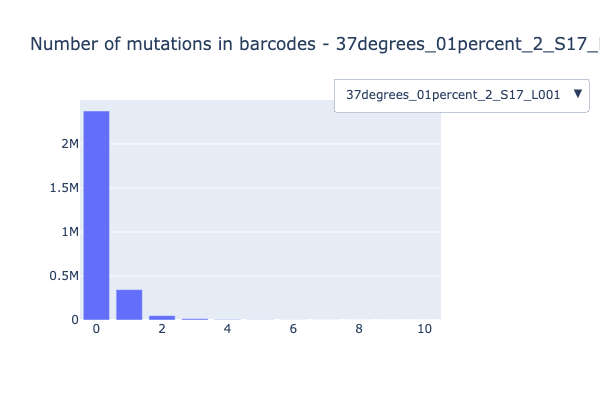
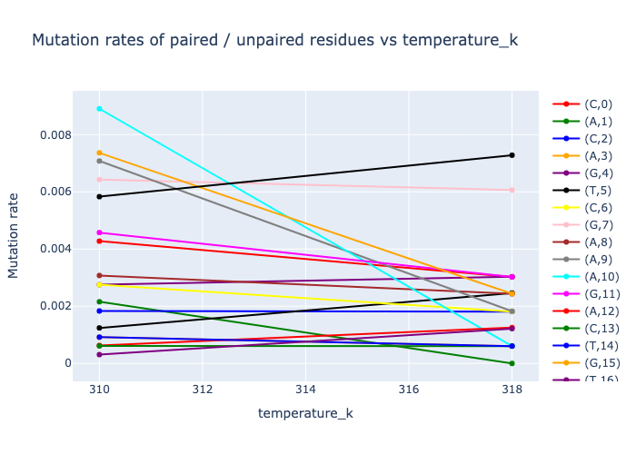
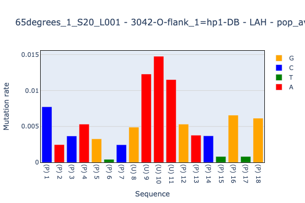
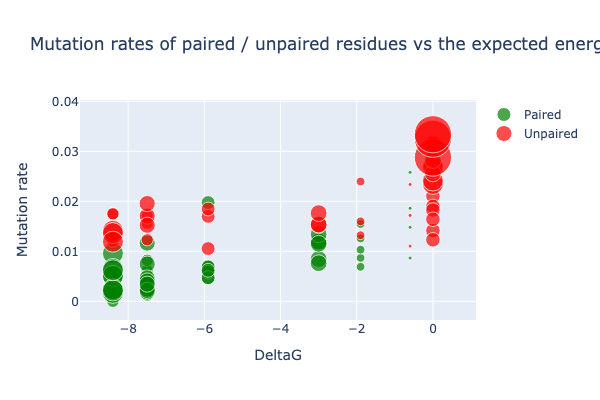
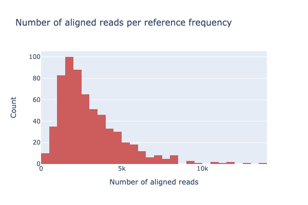
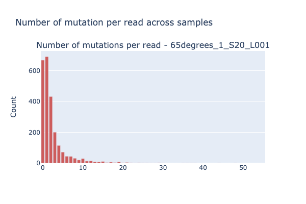

Gallery
=========

.. dropdown:: :fa:`eye,mr-1` Mutations in barcodes 

    .. autofunction:: dreem.draw.study.Study.mutations_in_barcodes
    

.. dropdown:: :fa:`eye,mr-1` Exp variable across samples 

    .. autofunction:: dreem.draw.study.Study.exp_variable_across_samples
    

.. dropdown:: :fa:`eye,mr-1` Mutation fraction 

    .. autofunction:: dreem.draw.study.Study.mutation_fraction
    

.. dropdown:: :fa:`eye,mr-1` DeltaG vs mut rates 

    .. autofunction:: dreem.draw.study.Study.deltaG_vs_mut_rates
    

.. dropdown:: :fa:`eye,mr-1` Num aligned reads per reference frequency distribution 

    .. autofunction:: dreem.draw.study.Study.num_aligned_reads_per_reference_frequency_distribution
    

.. dropdown:: :fa:`eye,mr-1` Mutations per read per sample 

    .. autofunction:: dreem.draw.study.Study.mutations_per_read_per_sample
    

